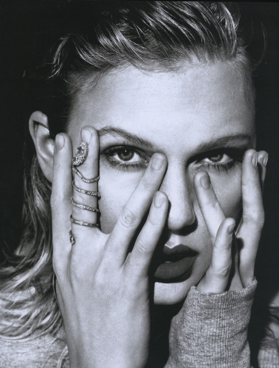
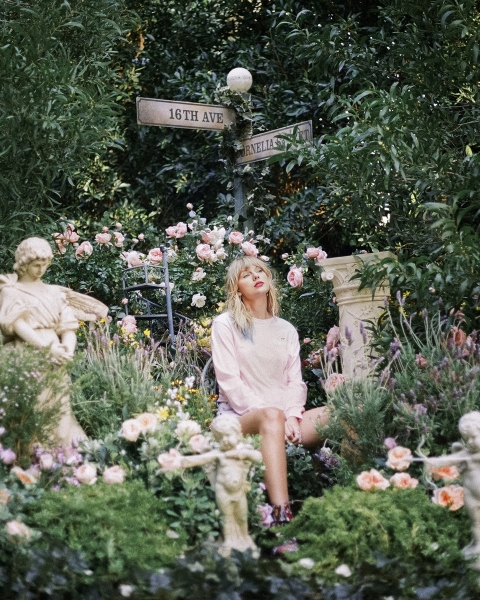
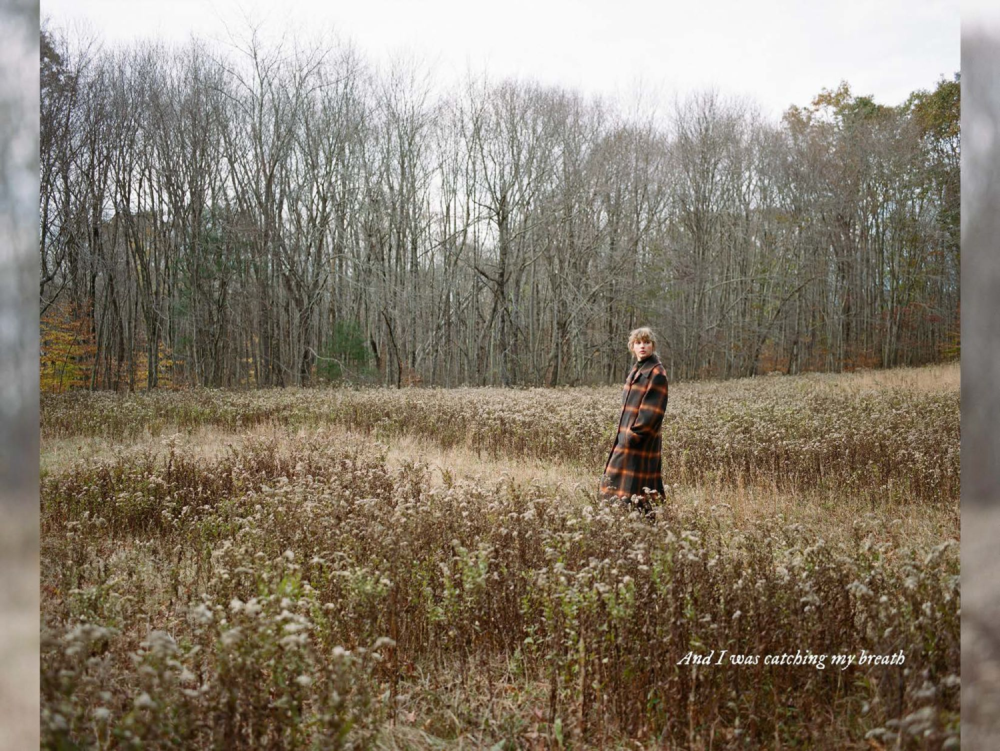

```{r setup, include=FALSE}
knitr::opts_chunk$set(echo = TRUE)
```

```{r pacotes, include=FALSE}
# Abrir Pacotes

library(dplyr)
library(tidyverse)
library(ggplot2)
library(readr)
library(lubridate)
library(forcats)
library(grDevices)
library(ggrepel)
```

# Introdução

Olá, meu nome é Amanda. Este é meu trabalho final para o curso de R para Ciência de Dados, da Curso-R. O objetivo é fazer um relatório em Markdown e construir gráficos de estilos diferentes. Escolhi realizar um trabalho com tema mais informal e consegui me divirtir incrivelmente nesses dias. Meu tema é estudar as músicas da Taylor Swift como dados. São discutidos temas como popularidade, "dançabilidade", energia, duração de músicas, valência até o destaque de meus álbuns preferidos, *folklore* e *evermore.* Éum *t*rabalho descontraído, mas que buscou utilizar as diversas ferramentas que foram ensinadas no curso. Espero que ao final, você tenha ouvido apenas uma música... eu vou cobrar!

[{width="668"}](https://www.taylorswiftweb.net/)

# Dados

Os dados que baseiam as análises deste relatório estão disponíveis publicamente no site [Kaggle](https://www.kaggle.com/), uma comunidade *online* que concentra diversas atividades para cientistas de dados. Para curiosos, como eu, há muitas bases de dados disponíveis e prontinhas para serem reviradas! Foi assim que encontrei as três bases de dados sobre a Taylor Swift. Temos uma [base](https://www.kaggle.com/thespacefreak/taylor-swift-spotify-data) que contém dados diversos sobre as músicas lançadas pela Taylor Swift em seus nove álbuns, com a devida substituição da versão antiga pela regravada de *Fearless (Taylor's Version)*. A base foi organizada por Jan Llenzl Dagohoy, utilizando dados fornecidos pelo Spotify WebAPI**.** Ao longo dos textos, faleremos mais sobre as variáveis utilizadas. Infelizmente, ainda não consta a recém lançada regravação de *Red (Taylor\`s Version)* , mas tudo bem... assim, eu posso usar como desculpa para te convidar a assitir o curta-metragem, dirigido e escrito pela Taylor Swift, para celebrar uma das músicas mais apreciadas pelos fãs, agora na sua versão de 10 minutos: [All too Well](https://www.youtube.com/watch?v=tollGa3S0o8).

##### pode ir, eu espero...

As outras duas [bases](https://www.kaggle.com/thespacefreak/taylor-swift-song-lyrics-all-albums?select=09-evermore_deluxe_version.csv) contêm dados sobre as letras dos dois últimos álbuns inéditos da Taylor Swift, *folklore* e *evermore*. Por que esses dois, eu me pergunto por você? Porque são meus favoritos! E o R nunca foi tão encantador, obrigada [CursoR](https://curso-r.com/)! O conteúdo dessas bases também é de Jan Llenzl Dagohoy, com informações do [genius](https://genius.com/). O interessante dessas bases será destacar algumas das minhas músicas preferidas, e essa seleção foi cruel. Na verdade nem posso pensar muito, senão não entrego relatório nenhum, então me contentei com *13* músicas. Confesso, desde já que, voluntaria e conscientemente, privilegiei a estética dos gráficos. Meu cobaia, digo, querido pai, me atentou para semelhança de cores, eu fiz adequações e até algumas poucas concessões, mas sempre voltei para o mais bonito. Não se desespere, ~~Amanda~~, estamos aprendendo a usar R falando de Taylor Swift, nada sério, por isso tudo bem escolher o mais bonito, neste caso são lindos tons de rosa. Abaixo introduzo os álbuns da Taylor Swift, por ano e com a quantidade de músicas.

```{r popularidade, message=FALSE, warning=FALSE, echo=FALSE}
# Importar base de dados
taylors_spotify <- read.csv("dados/taylorswift_spotify.csv")

# Criar coluna com ano de lançamento de cada álbum
ts_spotify <- taylors_spotify %>% 
mutate(as.Date(release_date, format("%Y-%m-%d"))) %>% 
  mutate(ano = year(release_date))

# Criar tabela com ano de cada álbum e quantidade de músicas
tabela1 <- ts_spotify %>% 
  group_by(ano, album) %>% 
  summarise(n = n_distinct(name)) %>% 
  rename(`Ano` = ano, `Álbum` = album, `Quantidade de Músicas` = n) 

tabela1 %>% 
  knitr::kable()

```

Vamos começar analisando a popularidade dos albúns e das músicas da Taylor. Podemos buscar entender pelas características que o Spotify atribui a cada uma das canções, como ser dançante ou energética. Passaremos, então, a considerar a duração de seus álbuns sem perder de vista a trajetória da sua carreira. Em seguida, faremos alguns testes de valência, ou seja, tem álbum que é predominantemente triste ou feliz (lembrando que são atribuições do Spotify). Por fim, enredaremos em *folklore* e *evermore.*

# Popularidade

Bem, estamos nos baseando em dados do Spotify, então a medida de popularidade é seu desempenho na plataforma. A Taylor Swift é uma das cantoras norte americanas mais famosas. Por isso, são monumentais as chances de você já ter ouvido alguma de suas músicas mesmo sem saber ou você se assemelha a mim e, na verdade, costuma passar vergonha em público porque não sabe se controlar e começa a cantar como se estivesse no chuveiro. É mais comum as pessoas conhecerem seus grandes sucessos na música pop, mas eu queria saber mais. Vamos começar analisando a popularidade de cada álbum no Spotify, considerando uma variação entre 0 e 100, sendo mais popular quanto maior o valor. Considera-se não apenas o quanto uma música é tocada, mas também o quão recentes são esses *streams*. Podemos ver os resultados na tabela abaixo.

```{r tabela de popularidade, message=FALSE, warning=FALSE, echo=FALSE}
ts_spotify %>% 
  group_by(ano, album) %>% 
  summarise(media_pop = mean(popularity)) %>%
  mutate(album = forcats::fct_reorder(album, media_pop)) %>% 
  ggplot(aes(x = ano, y = media_pop)) +
  geom_line(color = "#67223F", size=1.3) +
  scale_x_continuous(breaks = seq(2006, 2026, 2)) +
  scale_y_continuous(breaks = seq(0, 100, 20)) +
  coord_cartesian(xlim = c(2006, 2026), ylim = c(0, 100))+
  geom_point(color = "#67223F", size = 3.1) +
  geom_label_repel(aes(label = album),
                   color = "black",
                   size = 3.1,
                   alpha = 0.8) +
  labs(x = "Ano de Lançamento", y = "Popularidade",
       title = "Popularidade no Spotify",
       caption = "Fonte: Kaggle") +
  theme_minimal()
```

Até os dados Junho de 2021, data da última atualização dos dados, seus álbuns *reputation* e *Lover* são suas obras mais populares. Foi novidade para mim, eu não uso Spotify ^\*oops\*^, talvez daí venha a minha supresa. Na verdade, não sei bem o que esperava. Por um lado, *Red* parece ser um dos mais queridos pela Taylor e pelos fãs, e *1989* a lançou de vez para o pop. Por outro, há seus dois últimos álbuns, *folklore* e *evermore*, que marcaram outra virada no som da Taylor em direção ao folk-indie. Mas considerando bem, *Lover* foi seu último álbum lançado antes da pandemia, então houve muita divulgação com a presença da Taylor em programas de televisão e apresentações em premiações antes da tão ainda aguardada tournê. Numa combinação entre belas histórias de amor estilo *coming-of-age* e as que relatam um amor amadurecido, *Lover* também marca o maior engajamento público da Taylor em assuntos políticos, como direitos LGBTQ+ e o sexismo da insdústria musical estadunidense.

#### American stories Burning before me I'm feeling helpless The damsels are depressed Boys will be boys, then Where are the wise men? Darling, I'm scared

##### *Miss Americana & The HeartBreak Prince*

Além disso, talvez seja importante notar como *Lover* é a sucessão de *reputation*, voltando ao som mais pop romântico que havia sido, em parte, renunciado. O álbum *reputation* é lançado em 2017, sem aviso prévio, após dois anos em que a Taylor desapareceu da mídia. Em seu documentário, ["Miss Americana"](https://www.youtube.com/watch?v=sBeqHHcvA5Q), disponível na Netflix, Taylor relata como o escrutínio da mídia e a mobilização nas redes sociais para mandá-la mensagens de ódio diante do rompimento público de relações com a então família West se tornaram tão intoleráveis que ela desapareceu. Esse período, como ela conta, levou a descontrução de seu sistema de crenças baseado na ideia de ser "uma boa menina". A troca de som em *reputation*, também é acompanhada de uma mudança radical na estética. Com as cores pretas e o uso de cobra, Taylor tentava se apropriar da narrativa que criavam para ela. Mas quem ouve os álbum completo, percebe que diante dos anos tumultuados a Taylor se encontrou com seu *Lover,* em músicas como [Delicate](https://www.youtube.com/watch?v=tCXGJQYZ9JA). Esse vínculo entre os álbuns os torna ainda mais especiais, na minha opinão. A grandiosa tournê de *reputation* ainda é a mais rentável dos Estados Unidos. Para quem achou que a carreira tinha acabado, nada mal...

[](https://www.taylorswiftweb.net/)\

[{width="458"}](https://www.taylorswiftweb.net/)\

## Dançabilidade

A partir de uma combinação de elementos musicais, o Spotify oferece uma variável de "dançabilidade" de uma música. Eu queria testar se as músicas mais popualres são as mais propensas a fazer as pessoas mexerem as cadeiras. Então, eu fiz o teste abaixo em que cada ponto representa uma música.

```{r popularidade x dançabilidade, message=FALSE, warning=FALSE, echo=FALSE}
# Denifinir vetor de cores
ordem_cores_fortes <-  c("#67223F", "#81304E", "#9C3E5D",
                         "#B74D6C", "#CB627B", "#D97C8C",
                         "#E6959F", "#F4ADB3", "#FFC5C7")

# Músicas que se destacam em popularidade e dançabilidade
destaque_danca <- ts_spotify %>% 
  select(name, danceability) %>%
  arrange(desc(danceability)) %>% 
  slice(1:3)

destaque_pop <- ts_spotify %>% 
  select(name,popularity) %>%
  arrange(desc(popularity)) %>% 
  slice(1:3)

destaque_danca_pop <- ts_spotify %>% 
  filter(name %in% c("Blank Space", "Shake It Off", "Lover",
                     "I Think He Knows", "Treacherous - Original Demo Recording",
                     "Cornelia Street"))

# Gráfico de pontos Popularidade x Dançabilidade
ts_spotify %>% 
  filter(popularity != 0) %>% 
  group_by(name) %>% 
  ggplot(aes(x = popularity, y = danceability, color = album)) +
  geom_point(size = 3) +
  scale_color_manual(values = ordem_cores_fortes,
                     breaks = c("Taylor Swift", "Speak Now (Deluxe Package)",
                                "Red (Deluxe Edition)", "1989 (Deluxe)",
                                "reputation", "Lover", 
                                "folklore (deluxe version)", 
                                "evermore (deluxe version)",
                                "Fearless (Taylor's Version)")) +
  geom_label_repel(data = destaque_danca_pop, 
                   aes(label = name), 
                   color = "black",
                   size = 3.1,
                   alpha = 0.8,
  ) +
  labs(x = "Popularidade", y = "Dançabilidade", 
       color = "Álbum",
       size = 3.1,
       title = "Popularidade x Dançabilidade",
       caption = "Fonte: Kaggle") +
  theme_minimal()
```

Primeiramente, podemos notar, numa outra forma de visualizacão, como os álbuns mais antigos, representados por cores mais escuras, são menos populares; os mais recentes, representados por cores mais claras, ocupam majoritariamente uma posição central no gráfico; enquanto os álbuns de meio de carreira, são os mais popualres. Há uma tendência de as músicas mais populares serem também as mais dançantes. Como [Blank Space](https://www.youtube.com/watch?v=e-ORhEE9VVg) e [Shake It Off](https://www.youtube.com/watch?v=nfWlot6h_JM), ambas de*1989,* e [Cornelia Street](https://www.youtube.com/watch?v=VikHHWrgb4Y), de *Lover*. As exceções estão por [Treacherous](https://www.youtube.com/watch?v=u1D1AgDfreg), na versão original de *Red*, mas eu prefiro a regravada, e [Lover](https://www.youtube.com/watch?v=-BjZmE2gtdo), que é uma música estilo balada de casamento, muito em sintonia com o clima do álbum.

## Energia

Podemos também analisar a popularidade das músicas da Taylor Swift em relação a energia, uma medida de intensidade e atividade musical. O gráfico abaixo nos fornece mais informações.

```{r popularidade x energia, message=FALSE, warning=FALSE, echo=FALSE}

# Músicas que se destacam em energia
destaque_energia <- ts_spotify %>% 
  select(name,energy) %>%
  arrange(desc(energy)) %>% 
  slice(1:3)

destaque_energia_pop <- ts_spotify %>% 
  filter(name %in% c("Blank Space", "Shake It Off", "Lover",
                     "Haunted", "I'm Only Me When I'm With You", 
                     "Better Than Revenge"))

# Gráfico de pontos Popularidade x Energia
ts_spotify %>% 
  filter(popularity != 0) %>% 
  group_by(name) %>% 
  ggplot(aes(x = popularity, y = energy, color = album)) +
  geom_point(size = 3) +
  scale_color_manual(values = ordem_cores_fortes,
                     breaks = c("Taylor Swift", "Speak Now (Deluxe Package)",
                                "Red (Deluxe Edition)", "1989 (Deluxe)",
                                "reputation", "Lover", 
                                "folklore (deluxe version)", 
                                "evermore (deluxe version)",
                                "Fearless (Taylor's Version)")) +
  geom_label_repel(data = destaque_energia_pop, 
                   aes(label = name), 
                   color = "black",
                   size = 3.1,
                   alpha = 0.8) +
  labs(x = "Popularidade", y = "Energia", 
       color = "Álbum",
       size = 3.1,
       title = "Popularidade x Energia",
       caption = "Fonte: Kaggle") +
  theme_minimal()

```

Não há nenhuma relacão aparente entre energia e popularidade. Podemos, notar como os álbuns são dispersos no eixo da energia, indicando que há uma combinação de músicas mais e menos energéticas nos álbuns. Comparativamente, apenas os primeiros álbuns contêm mais músicas energéticas, por isso sua distribuição se concentra na parte superior do gráfico. Os destaques estão entre [Hauted](https://www.youtube.com/watch?v=OoQAyLditXQ) e [Better Than Revenge](https://www.youtube.com/watch?v=ziRR-doZAtg), ambas de *Speak Now,* e [I'm Only Me When I'm With You](https://www.youtube.com/watch?v=AlTfYj7q5gQ), de *Taylor Swift,* entre as mais energéticas.

# Duração das músicas

No gráfico abaixo podemos observar a dispersão da duração em milisegundos das músicas da Taylor, agregadas por álbuns. Entre os álbuns *Speak Now* e *Red*, ambos na versão deluxe, apresentam-se as maiores dispersões na duração das músicas. E *reputation* e *Fearless* apresentam as menores variações, ou seja, a duração das músicas está concentrada num valor próximo da mediana. Já em *folklore* a distribuição é mais simétrica do que, por exemplo, em *evermore*, mas mais dispersas do que em *Taylor Swift*. Os álbuns *1989* e *Lover,* apresentam dois *outliers* cada para músicas mais curtas e músicas mais longas, respectivamente.

```{r duração das músicas, message=FALSE, warning=FALSE, echo=FALSE}
# Boxplot
ts_spotify %>% 
  mutate(album = forcats::fct_reorder(album, ano)) %>%
  group_by(album) %>% 
  ggplot() +
  geom_boxplot(aes(x = length, y = album),
               fill = ordem_cores_fortes, color = "#636363") +
  labs(x = "Tempo(ms)", y = "Álbuns",
       title = "Duração das músicas",
       caption = "Fonte: Kaggle") +
  theme_minimal()

```

# Valência

Valência, neste caso, é uma medida de quão feliz ou triste a música soa, lembrando que são dados fornecidos pelo Spotify. Por ser reconhecida por seus *hits* pop, se imaginaria que os álbuns da Taylor tivessem uma valência positiva. No gráfico abaixo, temos que quanto mais próximo de um, mais feliz é o som da música. Assim, vemos que os todos seus álbuns, na média, têm valência abaixo de 0.5.

```{r valencia dos álbuns, message=FALSE, warning=FALSE, echo=FALSE}
# Gráfico de Barras
ts_spotify %>% 
  group_by(ano, album) %>% 
  summarise(media_valencia = mean(valence)) %>%
  mutate(album = forcats::fct_reorder(album, ano)) %>% 
  ggplot(aes(x = media_valencia, y = album)) +
  geom_col(fill = ordem_cores_fortes,
           show.legend = FALSE) +
  geom_label(aes(label = ano),
            size = 2.6) +
  labs(x = "Valência", y = "Álbum",
       title = "Valência",
       caption = "Fonte: Kaggle") +
  theme_minimal()
```

*Lover* é o álbum com maior valência, ou seja, com som mais feliz segundo a definição do Spotify; seguido por *Red* e *1989*, respectivamente. De fato, uma análise mais qualitativa dos álbuns atesta que os temas tratados são também, em geral, mais felizes. Destacando *Red* que é um álbum repleto de músicas que relatam as diferentes emoções envolvidas no rompimento de relações amorosas, muito além de tristeza podem ajudar a entender esse resultado. Entre os álbuns com menor valência temos *reputation*, seguido por *folklore* e *Fearless*. O que, para mim, ressalta como os *singles* não são necessariamente representativos de todo o trabalho da Taylor nos álbuns. Como se trata de uma média, é importante ressaltar que valores discrepantes podem influenciar o resultado final. Mas isso podemos observar melhor na sessão seguinte que relaciona valência e o quão acústica uma música soa.

## Versões acústicas

No gráfico abaixo, podemos observar a distribuição das múcias da Taylor Swift por álbum em relação a sua valência e som acústico. Quanto mais prócimo de um, maior a valência positiva e mais acústica a música.

```{r valencia x acústica por álbum, message=FALSE, warning=FALSE, echo=FALSE}
  
 ts_spotify %>% 
  mutate(album = forcats::fct_reorder(album, ano)) %>%
  group_by(name) %>% 
  ggplot() +
  geom_point(aes(x = acousticness, y = valence, color = album), 
             size = 2.6, 
             show.legend = FALSE) +
  facet_wrap(~ album, scales = "fixed") +
  scale_color_manual(values = ordem_cores_fortes) +
  labs(x = "Música acústica", y = "Valência", color = "Álbum",
       title = "Acústica x Valência",
       caption = "Fonte: Kaggle") +
  theme(plot.title = element_text(hjust = 0.5))+
  theme_minimal()
```

Podemos ver como *Speak Now, Red* e *Fearless* apresentam maior dispersão em relação a valência; sendo *reputation* o álbum com menor variabilidade. Em relação as músicas acústicas percebemos como, em geral, os álbuns contemplam tantos músicas com sons mais e menos acústicos. As exceções são *reputation* e *evermore*, com som menos acústicos e mais acústico respectivamente. É possível notar também que dentre todos os álbuns se destacam os dois últimos álbuns inéditos da Taylor, *folklore* e *evermore*, com som mais acústico o que se relaciona com o tom folk-indie que mencionei anteriormente e sobre o qual me debruçarei a seguir.

# folklore e evermore

```{r tabelas de folklore e evermore, message=FALSE, warning=FALSE, echo=FALSE}
ts_folklore <- read_csv("dados/taylorswift_folklore.csv")
ts_evermore <- read.csv("dados/taylorswift_evermore.csv")
```

[](https://www.taylorswiftweb.net/)

Bem, já foi estabelecido meu apreço por *folklore* e *evermore,* mas gostaria de enaltecer esses álbuns ainda mais. Cada música é uma estória cantada. São álbuns obras de introspecção, se a qualidade das descrições pode por instantes nos afastar dessas narrativas, nenhum sentimento ali nos é alheio. Conversamos com nós mesmos a cada música, ou aprendemos a ouvir com compaixão versões sobre os mesmos eventos. Musicalmente, a Taylor trabalhou com Aaron Dressner, da banda *The National,* e Jack Antonoff, com quem já colaborou extensamente antes. Mas vamos aos dados, podemos ver no gráfico abaixo a guinada ao folk pela tendência ao som acústico e a valência baixa. Destaquei também minhas músicas favoritas desses álbuns, o que foi quase mais difícil que assistir jogos do [Corinthians](https://ge.globo.com/futebol/times/corinthians/noticia/noticias-corinthians-invencibilidade-taylor-swift.ghtml) como visitante nesse brasileirão 2021.

```{r acústica e valência de folklore e evermore, message=FALSE, warning=FALSE, echo=FALSE}
# meus estaques de folklore e evermore
destaque_folklore_evermore <-  ts_spotify %>% 
  filter(name %in%  c("my tears ricochet", 
                      "seven", "this is me trying",
                      "epiphany",  "peace", 
                      "the lakes - bonus track",
                      "champagne problems",
                      "tolerate it", 
                      "happiness", 
                      "coney island (feat. The National)", 
                      "ivy", "cowboy like me", 
                      "evermore (feat. Bon Iver)"))

# Gráfico de pontos
ts_spotify %>% 
  filter(album %in% c("folklore (deluxe version)", 
                      "evermore (deluxe version)")) %>% 
  ggplot(aes(x = acousticness, y = valence, color = album)) +
  geom_point(size = 2.6) +
  scale_color_manual(values = c("#67223F", "#B74D6C"))+ 
  geom_label_repel(data = destaque_folklore_evermore, 
                   aes(label = name), 
                   color = "black",
                   size = 3.1,
                   alpha = 0.8)+ 
  labs(x = "Nível de acusticidade", y = "Valência", color = "Álbum",
       title = "Acústica x Valência",
       caption = "Fonte: Kaggle") +
  theme_minimal()
```

## folklore

[{width="681"}](https://www.taylorswiftweb.net/)

> #### A tale that becomes folklore is one that is passed down and whispered around. Sometimes even sung about. The lines between fantasy and reality blur and the boundaries between truth and fiction become almost indiscernible. Speculation, over time, becomes fact. Myths, ghost sotries, and fables. Fairytales and parables. Gossip and legend. Someone's secrets written in the sky for all to behold.

Minhas músicas mais queridas em *folklore*, são desabafos e confissões, são retratos de sofrimento e resiliência e esperança, são convites para fugir para algum lugar com lagos e flores silvetres ou um país curioso longe daqui. No gráfico abaixo, temos as linhas mais repetidas nas canções. Em ["this is me trying"](https://www.youtube.com/watch?v=9bdLTPNrlEg) vemos pessoas confessando que vêm tentando fazer o seu melhor, mesmo que pareça pouco, cada momento é uma jornada interna que as vezes seus conhecidos nem sabem a respeito. O desejo de se fazer compreender, para mim, é como um pedido desculpas, mas também de carinho. É um música repleta das melhores metáforas.

["The lakes"] (<https://www.youtube.com/watch?v=tOHcAc3r2kw>), por onde começar... é a canção do escapismo a moda dos antigos românticos, com os toques contemporâneos para descrever as chateações. Nada melhor do que chorar nos montes rodeados por flores silvestres de frente para os lagos, lugar das poesias mais tristes, não esqueça a musa! Já ["seven"](https://www.youtube.com/watch?v=pEY-GPsru_E) é dos contos de inocência mais tristes que já ouvi em música. Duas crianças se consolam e arquitetam a fuga para algum lugar longíquo, talvez a Índia, onde elas poderiam ser piratas. Mas por enquanto elas se escondem da maldade e covertem o choro em sonhos. ["Peace"](https://www.youtube.com/watch?v=pEY-GPsru_E) é uma das poucas músicas que a Taylor escreveu sobre sua prórpia vida, relatando as suas inseguranças no seu relacionamento, por um lado reafirmando sua devoção ao amado, por outro sua percepção de que uma vida ao seu lado jamais seria uma vida de paz. Aaraon Dressner comentou, no [\*Long pond studio](https://www.youtube.com/watch?v=hqQ5iTQRZAI)\*, como para ele se relacionava as dificuldades que sua saúde mental impoõem em seus relacionamentos. Assim como em "peace", ["my tears ricochet"](https://www.youtube.com/watch?v=OWbDJFtHl3w) também é sobre a Taylor e sua batalha para reconquistar suas músicas, passando por todo o sofrimento de ver sua obra de vida não estar em seu controle. Nem preciso ressaltar o liricismo nesses álbuns... ["Epiphany"](https://www.youtube.com/watch?v=DUnDkI7l9LQ) é, para mim, a obra de sentimentos mais pesados dentre os álbuns. Os destaques abaixo indicam o breve suspiro de esperança, mas os versos relatam estórias de desespero que dizem respeito a todos nós.

```{r favoritas de folklore, message=FALSE, warning=FALSE, echo=FALSE}

# Definir cores
cores_folklore <- c("#67223F", "#9C3E5D", "#CB627B", 
           "#D97C8C", "#E6959F", "#F4ADB3")

# Letras mais frequentes 
ts_folklore %>%
  group_by(track_title) %>% 
  filter(track_title %in% c("my tears ricochet", 
                            "seven", "this is me trying", 
                            "​epiphany",  "​peace", "​the lakes")) %>%
  count(lyric, track_title, sort = TRUE) %>%
  slice_max(n, n = 2) %>% 
  mutate(lyric = forcats::fct_reorder(lyric, track_title)) %>% 
  ggplot() +
  geom_col(aes(y = lyric, x = n, fill = track_title))+
  scale_fill_manual(values =  cores_folklore,
                    name = "Músicas Favoritas", 
                    breaks = c("this is me trying", "​the lakes",
                               "seven", "​peace", "my tears ricochet",
                               "​epiphany")) +
  labs(x = "Repetição", 
       y = "Letras",
       title = "Letras frequentes em folklore",
       subtitle = "Minhas favoritas") +
  theme(plot.title = element_text(hjust = 0.5),
        panel.grid.major = element_blank()) +
  theme_minimal()

```

## evermore

[](https://www.taylorswiftweb.net/)

> #### *To try and put it more poetically, it feels like we were standing on the edge of the folklorian woods and had a choice: to turn and go back or to travel further into the forest of this music. We chose to wander deeper in (...) and folklore's sister record is here. It's called evermore.*

Se assim como eu, você conhece de coração essas músicas, essas linhas são melodias. Em relação a *folklore, evermore* lida mais com começos e fins de relações diversas. Eu considero que em *evermore* as músicas, em geral, tem uma gravidade maior. As letras destacadas de ["tolerate it"](https://www.youtube.com/watch?v=ukxEKY_7MOc) revelam um relacionamento em que uma pessoa está profundamente envolvida, mas vê seu amor sendo tolerado ao invés de celebrado. O que parece ser um monólogo interno, em que a pessoa tenta se convencer a ir pedir para que seu amor revelasse que é algum tipo de malentendido, termina por... não... não posso contar o final. Já dei informações suficientes. ["Ivy"](https://www.youtube.com/watch?v=9nIOx-ezlzA) está no grupo das canções mágicas, mais aberta a explorar imagens fantasiosas e muito divertidas. Afinal, o eu-lírico é uma casa de pedras, e seu amante é uma hera que a cobre por inteiro.

["evermore"](https://www.youtube.com/watch?v=EXLgZZE072g)... é a viagem para o interior da floresta, o frio paralisa e faz perder os sentidos. O caminhar indica os estados emocionais, até que uma imagem de amor nos leva de volta para segurança. A dor, afinal, parece que não durará para todo sempre. Já em ["cowboy like me"](https://www.youtube.com/watch?v=YPlNBb6I8qU), uma das canções com tom mais do *country* relata o encontro inesperado de parceria entre aventureiros, eu adoro o som e um dos meus versos favoritos é:

> #### Now you hang from my lips Like the Gardens of Babylon With your boots beneath my bed Forever is the sweetest con.

##### Cowboy Like Me

Viu o que ela fez aí? Belíssima imagem dos Jardins Suspensos da Babilônia e o jogo de palavra entre *con* *artists* (trapaceiros), como são descritos os amantes, e a verdadeira, mas doce trapaça que é a promessa do "para sempre". Fico muito empolgada! Voltando para a sequência, como vista abaixo, temos ["coney island"](https://www.youtube.com/watch?v=c_p_TBaHvos) uma parceria cantada com The National, um conto trágico de lamentação, de desejo de ter feito diferente. São memórias diante da fatalidade. Por fim, ["champagne problem"](https://www.youtube.com/watch?v=wMpqCRF7TKg). é uma das favoritas dos fãs. É uma música que prossegue na narrativa sem muitas repetições, exceto pela letra "champagne problems". São reconhecidas as implicações de suas ações sobre o outro, sobre os comentários, mas permanece um tom de consolo. Não me decidi exatamente, mas para mim há contemplação e serenidade.\

```{r favoritas de evermore, message=FALSE, warning=FALSE, echo=FALSE}

# Definir cores
cores_evermore <- c("#67223F", "#9C3E5D", "#9C3E5D", "#CB627B", 
           "#D97C8C", "#E6959F", "#F4ADB3")


ts_evermore %>%
  group_by(track_title) %>% 
  filter(track_title %in% c("champagne problems",
                           "​tolerate it", "​happiness",
                            "​coney island", 
                            "​ivy", "cowboy like me", 
                            "​evermore")) %>%
  count(lyric, track_title, sort = TRUE) %>%
  slice_max(n, n = 2) %>% 
  mutate(lyric = forcats::fct_reorder(lyric, track_title)) %>% 
  ggplot() +
  geom_col(aes(y = lyric, x = n, fill = track_title))+
  scale_fill_manual(values =  cores_evermore,
                    name = "Músicas Favoritas",
                    breaks = c("​tolerate it", "​ivy",
                               "​happiness", "​evermore",
                               "cowboy like me", 
                               "​coney island",
                               "champagne problems"))+
  labs(x = "Repetição", 
       y = "Letras",
       title = "Letras frequentes em evermore",
       subtitle = "Minhas favoritas") +
  theme(plot.title = element_text(hjust = 0.5),
        panel.grid.major = element_blank()) +
  theme_minimal()

```

# Conclusão

Os gostos músicas são muito particulares, mas gosto de pensar que sempre há algo novo a ser explorado onde não imaginávamos ir. Taylor Swift é uma artista que realiza suas obras com o cuidado daqueles que nutrem suas paixões. Nem todo mundo vai gostar de suas músicas, eu não amo todas elas... Mas se estivermos sempre prontos para ouvir, com certeza aprenderemos algo novo.

#### *Afinal, qual música você ouviu?*

[](https://www.taylorswiftweb.net/)
